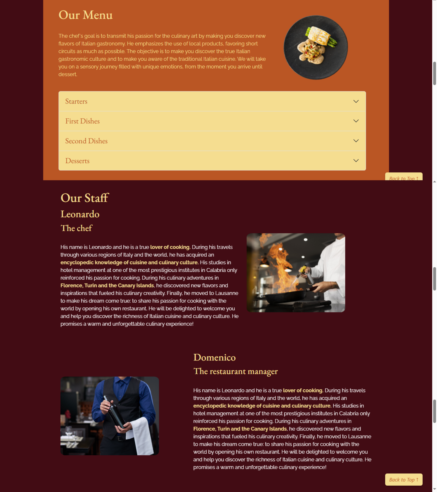
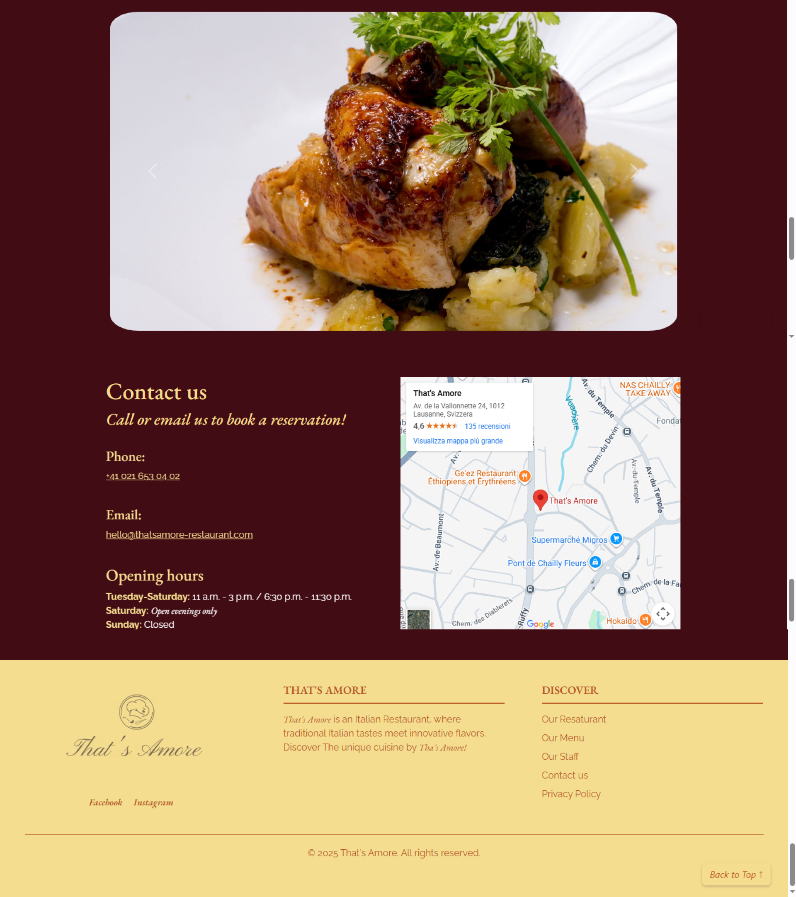
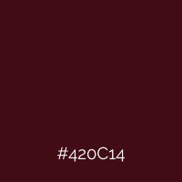
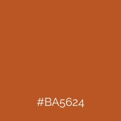
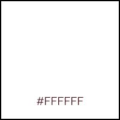
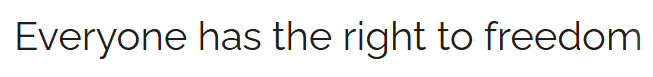

##  Idea and design

<em>That’s Amore</em> is an Italian restaurant located in Lausanne. The restaurant has a multi-media presence in the Internet: it has a social media account and a web site. 

My idea was to refactor the entire web site, transforming it into a **single-page website**, which can be easily navigated using a classic menu. 

In my opinion, the original website was outdated and poorly structured. 
I therefore reorganized the information and redesigned the layout, choosing **a bolder, more appealing color palette and fonts** that better represent the activity. 

---

Some problems encountered on the **original websites**:
 
<ul>
<li>Site width exceeds device width</li>
<li>Text too big</li>
<li>Confusing navigation</li>
<li>Low-quality images</li>
<li>Bad responsiveness on different devices</li>
</ul>
 

**Goals** for the new website:
 
<ul>
<li>Responsiveness on different devices</li>
<li>High-quality contents</li>
<li>User-friendly navigation</li>
<li>Greater appeal</li>
<li>Better organization of contents</li>
</ul>

---

## Redesign 
<h3><a href="https://www.thatsamore-restaurant.ch/en">ORIGINAL VERSION</a></h3>

---

## Redesign 
### NEW VERSION

---

### Colors

<strong>"Wine"</strong> (cod. 420C14) - A drink that never misses on Italian tables. I chose this color for the background of the entire web site and some color accents.

<strong>"Pasta"</strong> (cod. F5DD90) - A food symbol of Italy. I used this color for bolds, buttons, footer and header backgrounds, and headlines.

<strong>"Brick"</strong> (cod. BA5624) - I chose this "transition" color for boxes, some color accents (such as links), and text in the footer and in the header.

<strong>White</strong> (cod. FFFFFF) - I used it for paragraphs and on dark backgrounds.

   

---

### Fonts and images

I used the font <strong>"Raleway"</strong> for the paragraphs and buttons.
 

 
I chose the font <strong>"EB Garamond"</strong> for headlines in the body, in the menu and in the footer.
 

 

I chose images which could reflect the elegance of the restaurant and that f the Italian cuisine, as well as the creation of the video. 

I tried to refactor the web site following a **coherent style**, that could help the restaurant to distinguish itself from the others and to create **a strong brand identity**.

---

## Technologies

To create <em>That’s Amore</em> web site I used the technology learned during the lectures: <strong>HTML</strong> to create the page, <strong>CSS</strong> to create the style, <strong>JavaScript</strong> to animate the web site and Bootstrap to make it responsive on different devices. 

To write the entire code I used <strong>VS Code</strong> as we have seen during classes. 

Additional technologies I used are <strong>Canva</strong> to redimensionate images and to create the menu pdf, and <strong>CapCut</strong> to create the initial video. 

---

## Long-term plans

I hope <em>That’s Amore</em> web site can be useful in the future to improve its business and to increase its customers. The idea is **to monitor traffic trends** using the appropriate tools.

Another change that will be made in the future, as the customer base grows, will be to introduce **an online booking system** linked to Excel, so that we can obtain a file that is organized and constantly updated on a weekly basis regarding bookings. This will also allow for better management from both the user and restaurant owner perspectives. 

Finally, the idea is **to keep the site constantly updated** with new photos, seasonal menus, holiday menus, etc.

---

## What did I learn from this course?

Thanks to this course I learned to create simple web sites or landing pages. 
Even if I won’t be an expert programmer, I think all I learned during this course will be **useful both for my CV and for my job.** 

In my opinion, knowing the basis of HTML, CSS and JavaScript languages can help you:
- to manage CMS easily
- to be more aware of web sites and how they work
- to intervene and modify features of already built web sites

In addition to this, I noticed that thanks to this kind of language **your approach to web sites changes** as well as **your way of thinking of it and of the process to build a new one.**

# THANK YOU {.center-slide}